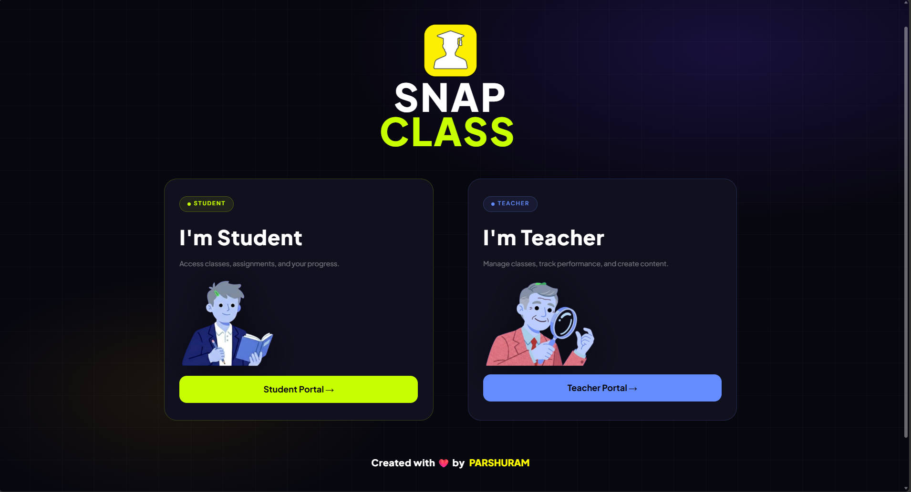
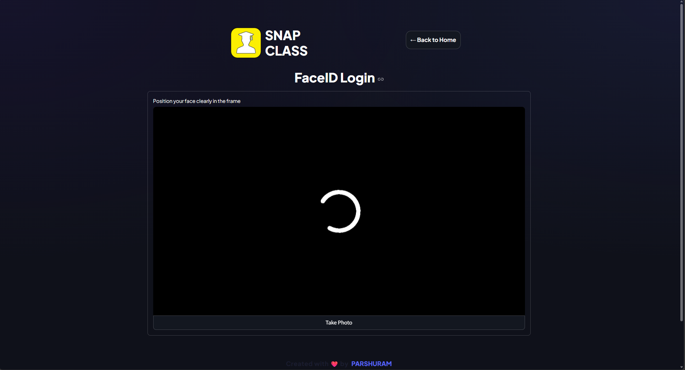
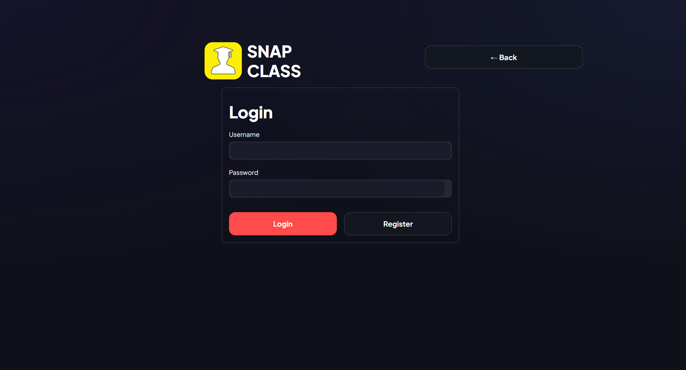

# 🎓 Snap Class: AI-Powered Attendance System

Snap Class is an AI-powered smart attendance system that replaces manual roll calls with real-time **FaceID** and **Voice Biometrics**—making attendance fast, secure, and fully automated.

---

## 🚀 Key Features

* 🔐 **FaceID Authentication**
  Detects and verifies students using facial recognition (prevents proxy attendance)

* 🎤 **Voice Biometrics**
  Optional voice-based identity verification

* 📊 **Modern Dashboard UI**
  Clean glassmorphism design with dark theme

* 📱 **QR Code Check-in**
  Quick attendance using QR system

* ⚡ **Real-time Attendance Tracking**
  Instant logging and session monitoring

* 🧑‍🎓 **Smart Enrollment System**
  Join classes using subject codes

---

## 🛠️ Tech Stack

* **Frontend:** Streamlit
* **Backend:** Supabase (PostgreSQL + Auth)
* **AI/ML:**

  * face_recognition (Dlib)
  * resemblyzer
  * scikit-learn
* **Utilities:** librosa, segno, pillow

---

## 📸 Screenshots

### 🏠 Home Page

<p align="center">
  
</p>

---

### 🔐 FaceID Login

<p align="center">
  
</p>

---

### 🔑 Login Page

<p align="center">
  
</p>

---

### 📊 Dashboard

<p align="center">
  
</p>

---

## 🏗️ System Architecture

* **Streamlit** → Frontend Interface
* **Supabase** → Database & Authentication
* **Face Recognition** → Identity Verification
* **Resemblyzer** → Voice Processing

---

## 📦 Installation & Setup

### 1️⃣ Clone Repository

```bash
git clone https://github.com/your-username/snap-class.git
cd snap-class
```

### 2️⃣ Install Dependencies

> ⚠️ Requires CMake & C++ Build Tools for dlib

```bash
pip install -r requirements.txt
```

### 3️⃣ Setup Environment Variables

Create `.streamlit/secrets.toml`

```toml
SUPABASE_URL = "your_supabase_url"
SUPABASE_KEY = "your_supabase_key"
```

### 4️⃣ Run the Application

```bash
streamlit run app.py
```

---

## 🔐 Security Features

* Face + Voice biometric authentication
* Secure Supabase authentication
* Password hashing using bcrypt
* Prevents proxy attendance

---

## 🚧 Future Enhancements

* 📱 Mobile application
* 🛡️ Liveness detection (anti-spoofing)
* 📊 Advanced analytics dashboard
* 👥 Multi-face detection

---

## 🤝 Contributing

Contributions are welcome!
Feel free to fork and submit pull requests.

---

## 👨‍💻 Author

**Parshuram Prajapati**
📍 Vijayapur, India
🌐 [parshfolio](https://parshuram-portfolio-6xjk.vercel.app/)

---

## ⭐ Support

If you like this project, give it a ⭐ on GitHub!

---

## 📄 License

This project is licensed under the MIT License.
